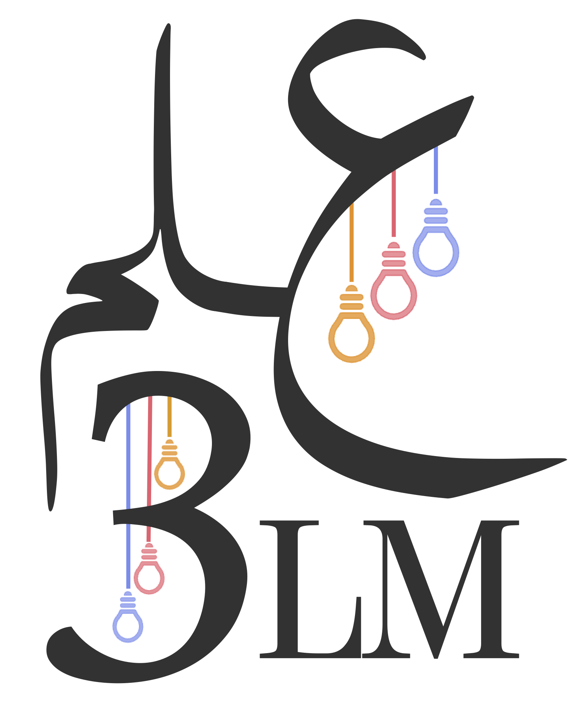
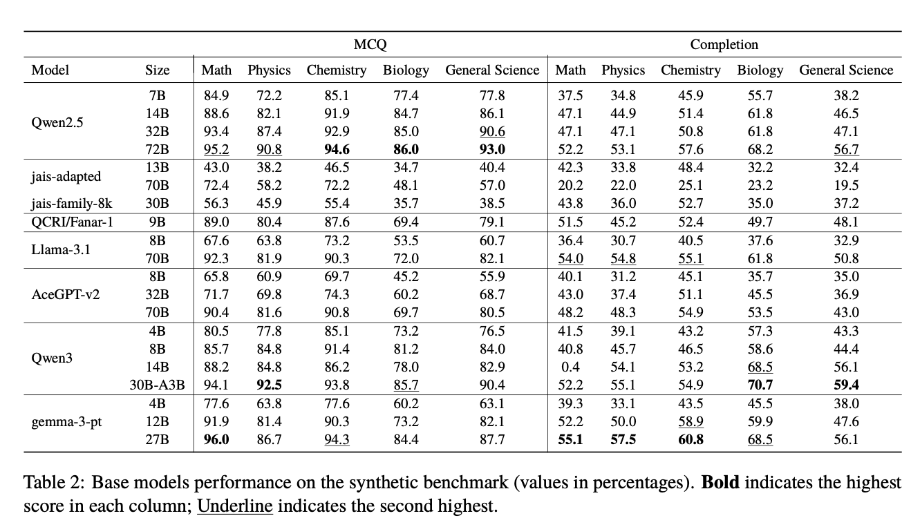

<p align="center">
  
</p>

<h1 align="center"><strong>3LM Benchmark</strong></h1>
<h3 align="center">Arabic Evaluation in STEM and Code</h3>

<p align="center">
  <a href="https://github.com/tiiuae/3LM-benchmark">GitHub</a> ·
  <a href="https://tiiuae.github.io/3LM-benchmark">Dataset</a> ·
  <a href="https://arxiv.org/abs/2507.xxxxx">Paper</a>
</p>

---


<!-- # 3LM Benchmark: Arabic Evaluation for STEM and Code 🧪💻📚

Welcome to the official repository of **3LM** a comprehensive benchmark suite tailored to evaluate Arabic Large Language Models (LLMs) across scientific and technical domains, including **STEM** (Science, Technology, Engineering, and Mathematics) and **code generation**.

🔗 [Paper on arXiv](https://arxiv.org/abs/2507.xxxxx)  
📊 [Evaluation Tools](https://github.com/tiiuae/3LM-benchmark)

--- -->

## 🧠 What is 3LM?

**3LM (علم)** is the **first Arabic-native benchmark** suite dedicated to **scientific reasoning and programming**. It contains three sub-benchmarks:

1. **Native STEM**: 865 multiple-choice questions (MCQs) from real Arabic educational materials (biology, physics, chemistry, math, and geography).
2. **Synthetic STEM**: 1,744 high-difficulty MCQs generated using the [YourBench](https://github.com/huggingface/yourbench) pipeline from Arabic educational texts.
3. **Arabic Code Benchmarks**: HumanEval and MBPP datasets translated into Arabic via GPT-4o and validated with backtranslation and human review.

These datasets are designed to **evaluate Arabic LLMs** in domains that require structured reasoning and formal knowledge which are often overlooked in existing benchmarks.

---

## 🚀 Key Results

We evaluated over **40 LLMs**, including Arabic-centric, multilingual, and bilingual models. Here are some highlights:

- **Gemma-3-27B** achieved the **highest average performance** on the STEM completion benchmark.
- **Qwen2.5-72B** excelled in MCQ-based evaluation across all domains.
- Arabic code generation performance strongly **correlates** with English code generation (r ≈ 0.97).
- **Robustness tests** (e.g., distractor perturbation) revealed instruct-tuned models are more resilient than base models.

<p align="center">
  
</p>

You can explore full results and correlation analyses in the [paper](https://arxiv.org/abs/2507.xxxxx) and via our scripts.

---

## 📦 How to Use the Benchmark

Clone the repo and install dependencies:
```bash
git clone https://github.com/tiiuae/3LM-benchmark.git
cd 3LM-benchmark
pip install -r requirements.txt
```

Run evaluation on your model:
```bash
python evaluate_stem.py --model_name <your-model-name>
python evaluate_code.py --model_name <your-model-name>
```

All evaluation is built on:
- `lighteval` for STEM QA
- `evalplus` for code pass@1 metrics

📁 The datasets are available on HuggingFace:
- SyntheticQA: https://huggingface.co/datasets/tiiuae/SyntheticQA
- NativeQA: https://huggingface.co/datasets/tiiuae/NativeQA
- NativeQA-RDP: https://huggingface.co/datasets/tiiuae/NativeQA-RDP
- Evalplus-Arabic: https://huggingface.co/datasets/tiiuae/evalplus-arabic

📁 Code datasets are in `data/` and include:
- `humaneval-ar.json`
- `mbpp-ar.json`

---

## 🔁 Reproducing Results

To replicate our paper results:
```bash
bash scripts/reproduce_all.sh
```

This will:
- Run both MCQ and completion evaluations
- Log per-domain and overall accuracy
- Evaluate both base and instruct models
- Output pass@1 scores for Arabic and English code

Ensure you have access to models via HuggingFace or your own inference setup.

---

## 📝 Citation

If you use 3LM in your research, please cite our paper:

```bibtex
@article{boussaha2025threeLM,
  title={3LM: Bridging Arabic, STEM, and Code through Benchmarking},
  author={Boussaha, Basma El Amel and AlQadi, Leen and Farooq, Mugariya and Alsuwaidi, Shaikha and Campesan, Giulia and Alyafeai, Mohammed and Alzubaidi, Ahmed and Hacid, Hakim},
  journal={arXiv preprint arXiv:2507.xxxxx},
  year={2025}
}
```
