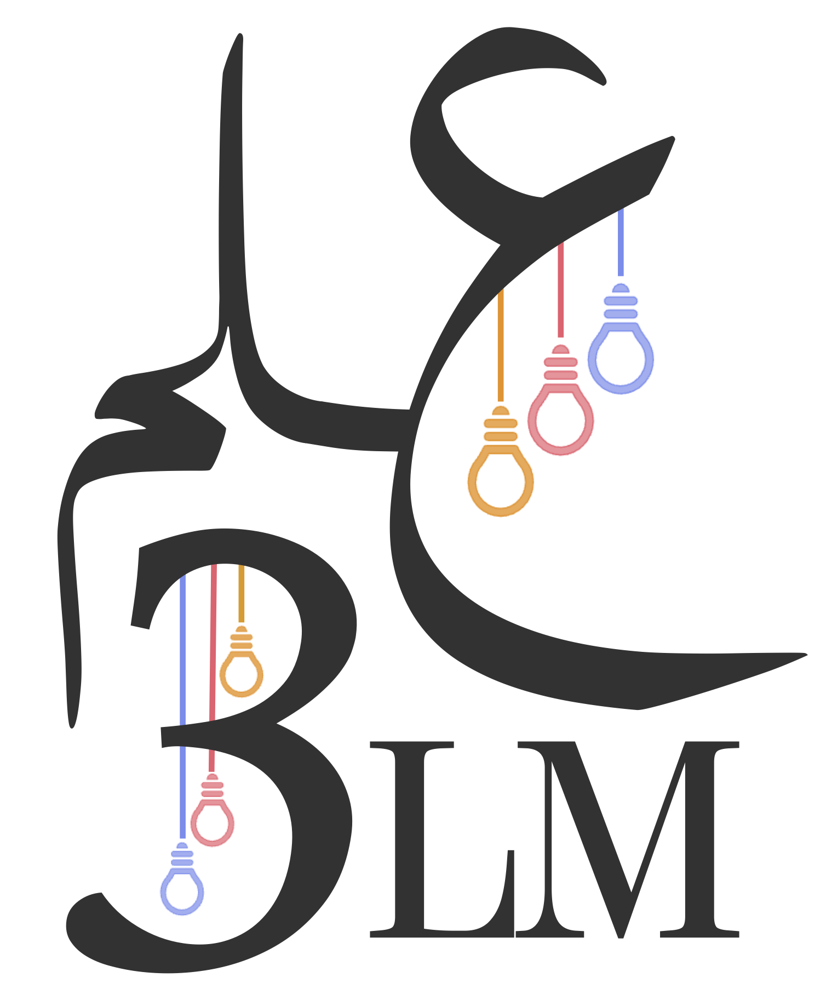
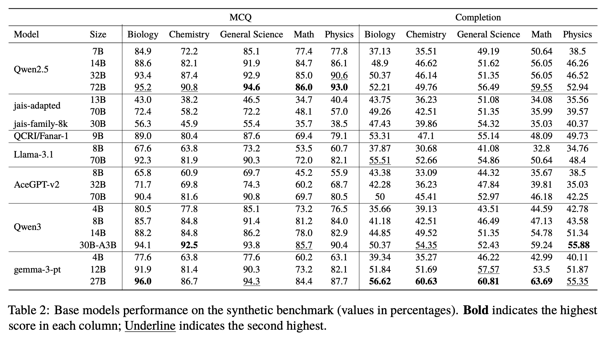

<p align="center">
  
</p>

<h1 align="center"><strong>3LM Benchmark</strong></h1>
<h3 align="center">Arabic Evaluation in STEM and Code</h3>

<p align="center">
  <a href="https://github.com/tiiuae/3LM-benchmark">GitHub</a> ·
  <a href="https://huggingface.co/collections/tiiuae/3lm-arabic-benchmark-687de9629072871e702d35e1">Datasets</a> ·
  <a href="https://arxiv.org/pdf/2507.15850">Paper</a> ·
  <a href="https://huggingface.co/blog/tiiuae/3lm-benchmark">Blog</a>
</p>

---

## 🧠 What is 3LM?

**3LM (علم)** is the **first Arabic-native benchmark** suite dedicated to **scientific reasoning and programming**. It contains three sub-benchmarks:

1. **Native STEM**: 865 multiple-choice questions (MCQs) from real Arabic educational materials (biology, physics, chemistry, math, and geography).
2. **Synthetic STEM**: 1,744 high-difficulty MCQs generated using the [YourBench](https://github.com/huggingface/yourbench) pipeline from Arabic educational texts.
3. **Arabic Code Benchmarks**: HumanEval and MBPP datasets translated into Arabic via GPT-4o and validated with backtranslation and human review.

These datasets are designed to **evaluate Arabic LLMs** in domains that require structured reasoning and formal knowledge which are often overlooked in existing benchmarks.

---

## 🚀 Key Results

We evaluated over **40 LLMs**, including Arabic-centric, multilingual, and bilingual models. Here are some highlights:

- **Gemma-3-27B** achieved the **highest average performance** on the STEM completion benchmark.
- **Qwen2.5-72B** excelled in MCQ-based evaluation across all domains.
- Arabic code generation performance strongly **correlates** with English code generation (r ≈ 0.97).
- **Robustness tests** (e.g., distractor perturbation) revealed instruct-tuned models are more resilient than base models.

<p align="center">
  
</p>

You can explore full results and correlation analyses in the [paper](https://arxiv.org/abs/2507.15850) and via our scripts.

---

<!-- ## 📦 How to Use the Benchmark -->
## 📦 Evaluate Your Model

1. Clone the 3LM-benchmark
```bash
git clone https://github.com/tiiuae/3LM-benchmark.git
```
2. Setup your conda environment and install required modules
```bash
conda create -n 3lm_eval python==3.11
conda activate 3lm_eval
pip install -e frameworks/lighteval  #add [vllm] if you intend to use vllm as backend
pip install -e frameworks/evalplus-arabic 
huggingface-cli login --token <HF-token> ## ignore if evaluated model is stored locally  
```

3. Launch evaluation scripts

```bash
python launch_eval.py -c examples/lighteval_3lm.yaml ## synthetic + native
python launch_eval.py -c examples/lighteval_native.yaml ## native
python launch_eval.py -c examples/lighteval_synthetic.yaml ## synthetic
python launch_eval.py -c examples/evalplus_arabic_code.yaml ## code
```
Modify the configs in the above paths to specify the model and other evaluation parameters (e.g., chat_template, engine, etc.).

All evaluation is built on:
- `lighteval` for STEM QA
- `evalplus` for code pass@1 metrics

📁 The datasets are available on HuggingFace:
- SyntheticQA: https://huggingface.co/datasets/tiiuae/SyntheticQA
- NativeQA: https://huggingface.co/datasets/tiiuae/NativeQA
- NativeQA-RDP: https://huggingface.co/datasets/tiiuae/NativeQA-RDP
- Evalplus-Arabic: https://huggingface.co/datasets/tiiuae/evalplus-arabic

📁 Code datasets are in `frameworks/evalplus-arabic/evalplus/data/data_files/` and include:
- `HumanEvalPlus.jsonl.gz`
- `MBPPPlus.jsonl.gz`

---

## 🪪 Licence

[Falcon LLM Licence](https://falconllm.tii.ae/falcon-terms-and-conditions.html)


## 📝 Citation

If you use 3LM in your research, please cite our [paper](arxiv.org/pdf/2507.15850):

```bibtex
@article{boussaha2025threeLM,
  title={3LM: Bridging Arabic, STEM, and Code through Benchmarking},
  author={Boussaha, Basma El Amel and AlQadi, Leen and Farooq, Mugariya and Alsuwaidi, Shaikha and Campesan, Giulia and Alzubaidi, Ahmed and Alyafeai, Mohammed and Hacid, Hakim},
  journal={arXiv preprint arXiv:2507.15850},
  year={2025}
}
```
